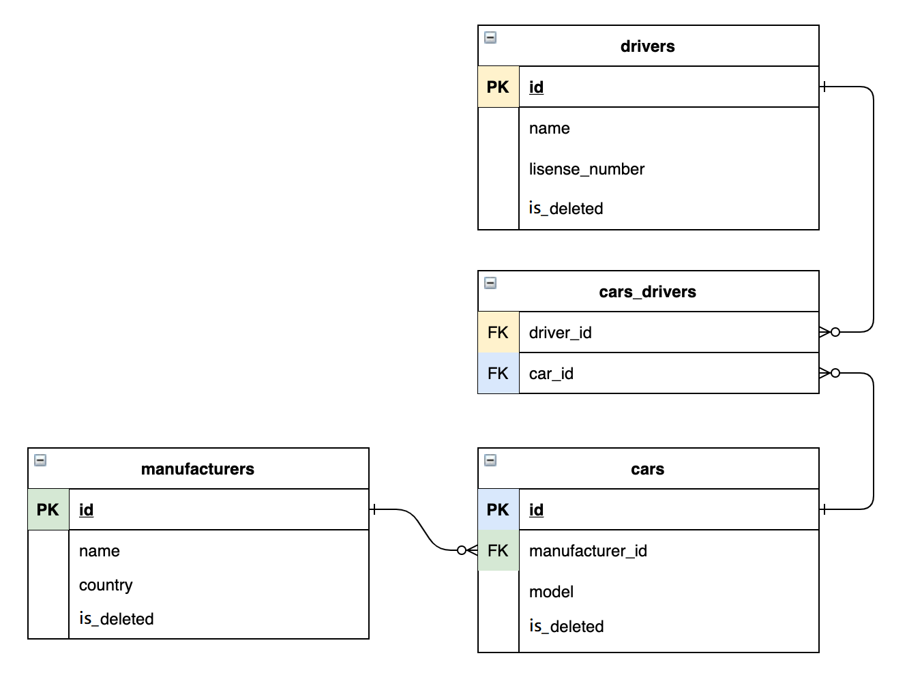

# Taxi Service

## Description
This taxi service is a simple web application 

## Technologies
* Java 11
* MySQL
* JDBC
* HTML, CSS,
* JSP, JSTL
* Maven

## Features
* registration/authentication like a driver;
* create/remove a manufacturer;
* create/remove a car;
* create/remove a driver;
* assigning drivers to cars
* display list of all manufacturers;
* display list of all cars;
* display list of all drivers;
* display all cars for authenticated driver;

## Project structure
Project consist of three layers:

1. DAO - Data access layer
2. Services - Business layer
3. Controllers - UI layer

Table relations

## Startup instructions

1. Install Intellij IDEA Ultimate
2. Install MySql
3. Install Apache Tomcat
4. Configure Apache Tomcat for your IDE
5. Clone this project
6. Create a database by using the SQL queries from the `init_db.sql` file
7. Change `USERNAME`, `PASSWORD` and `URL` values in the `/util/ConnectionUtil.java`
8. Launch application and start using it at `http://localhost:%your_port%`
